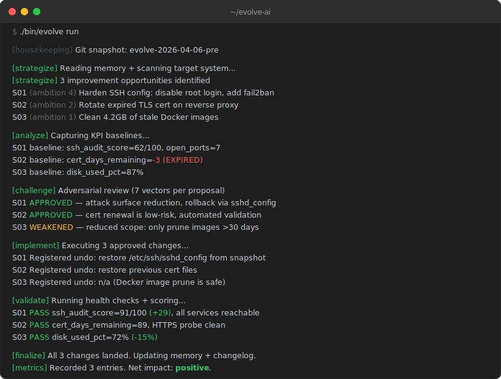

<div align="center">
  

  <h1>evolve-ai</h1>
  <p><strong>Autonomous improvement loop for anything you can describe.</strong></p>

  <a href="LICENSE"></a>
  <a href="tests/"></a>
  <a href="#requirements"></a>
  <a href="docs/architecture.md"></a>

  <br><br>
</div>

Your test coverage is slipping. A config file drifted three weeks ago and nobody noticed. Your agent prompts could be tighter but there are forty of them and who has time. The security advisory RSS feed has been piling up unread.

You could audit, plan, implement, test, and rollback — every day — for every system you run. Or you could point evolve-ai at it and go do something else.

**evolve-ai is an autonomous improvement loop for anything you can describe.** Infrastructure, codebases, LLM agent systems, homelabs — define what "better" looks like and it handles the rest: scanning for gaps, proposing changes, adversarially challenging its own ideas, implementing the survivors, validating them, rolling back failures, and measuring impact. Daily, event-triggered, or both. Unattended, with full rollback safety and human re-entry at every decision point.

---

## The organism

evolve-ai is modeled after a living organism. Each component has a biological analog — understanding the metaphor is understanding the system.

| Component | Analog | Role |
|---|---|---|
| **Genome** | DNA | Encodes target identity — scans, health checks, safety rules, rollback strategies |
| **Lens** | Sensory organs | Concern-based intelligence gathering from RSS, commands, file drops, agents |
| **Pool** | Bloodstream | JSON state machine tracking every proposal from `pending` to `landed` or `killed` |
| **Challenge** | Immune system | Adversarial review — 7+ attack vectors before anything touches the target |
| **Finalize** | Natural selection | Positive impact lands, negative impact reverts, repeated failures are killed |
| **Memory** | Long-term memory | 7 files of cross-run state — facts, changelog, vision, strategy, metrics |
| **Resume** | Consciousness | Re-enterable context files — inhabit any decision point after the fact |
| **Directives** | Instincts | Persistent rules from experience that shape future runs without human presence |
| **Circuit breaker** | Pain reflex | 3+ negative impacts in 7 days halts the pipeline and alerts a human |
| **Meta-agent** | Evolution | Weekly outer loop that tunes the pipeline's own prompts, weights, and sources |
| **Scoring** | Nervous system | 4-layer feedback: heuristics, LLM judge, KPI baselines, user-defined checks |

See [docs/architecture.md](docs/architecture.md) for full descriptions of each component.

---

## See it work

Here is what a typical `evolve run` looks like against an infrastructure target:

<div align="center">
  
</div>

<br>

Three problems found, challenged, fixed, validated, and documented — without you touching a terminal.

A directed run works the same way, but starts with the lens gathering intelligence from your concerns:

```
$ echo "CVE-2026-1234 affects openssl 3.x" > inbox/security-posture/pending/cve-note.txt
$ ./bin/evolve run --directed

[lens] Gathering intelligence from 3 concerns...
  security-posture:  1 new item (human drop), 2 feed items (RSS + error log)
  resource-drift:    1 feed item (daily snapshot)
  service-health:    0 new items

[digest] Processing 4 items across 2 concerns...
  I-001  RESEARCH_PASS  (security-posture) OpenSSL CVE — upgrade path available
  I-002  RESEARCH_DROP  (security-posture) Error log noise — no actionable pattern
  I-003  RESEARCH_PASS  (resource-drift)   Disk at 88% — cleanup candidate

[strategize] ...
```

---

## Why evolve-ai?

"How is this different from a cron script? Or Dependabot? Or a linter?"

**It reasons about whether to act.** Every proposal goes through an adversarial challenge phase that tries to kill it with 7+ attack vectors before any code runs. Bad ideas die before they touch your system.

**It lets you re-enter any decision.** Every choice the pipeline makes produces a resume context. Disagree with something? Run `evolve resume <id>` and steer it interactively.

**It measures actual impact.** Four-layer scoring — automated metrics, LLM evaluation, KPI baselines, and your own custom checks — means every change is measured before and after. Negative impact triggers automatic rollback. Validation uses a 3-tier model: static checks, functional verification, and resource-gated intelligent adversarial review.

**It improves itself.** A meta-agent (outer loop) evaluates the pipeline's own performance weekly and tunes prompts, scoring weights, and source credibility. The system that improves your systems also improves itself.

**It perceives through lenses, not dumb feeds.** Each genome defines a lens — a set of concerns it watches for (security posture, dependency health, resource drift). A concern can pull from multiple feeds, accept human file drops, receive agent pushes, and trigger deep web research. Intelligence is organized by *what matters*, not by what protocol delivered it.

**It rolls back first, asks questions later.** Every change must register its undo command before executing. If validation fails, the rollback is already staged.

This is not a linter, a dependency updater, or an alert system. It is an autonomous loop that perceives, reasons, acts, validates, and learns — across any target you can describe.

---

## Quick start

```bash
git clone https://github.com/dandezmirean/evolve-ai.git
cd evolve-ai
./bin/evolve init
```

The init wizard walks you through target selection, LLM provider, notifications, safety rules, and scheduling. Then:

```bash
./bin/evolve run
```

That's it. Your first autonomous improvement cycle runs immediately.

### Requirements

- Bash 4+
- jq
- yq
- curl
- md5sum (coreutils)
- An LLM provider

### LLM provider

evolve-ai is LLM-agnostic — it works with any provider that can take a prompt and return structured text. That said, the pipeline is compute-hungry. Each run invokes the LLM 8+ times across phases, and complex targets can run 20+ invocations per cycle with sub-invocations for validation and scoring. The more capable the model and the more generous the rate limits, the better the results.

The recommended setup is **Claude with a Max plan** — unlimited use on the most capable model, no per-token billing, and rate limits that comfortably handle daily autonomous runs. During `evolve init`, select "Claude via claude.ai (Max plan)" as your provider and authenticate via `claude.ai` OAuth. No API key needed.

---

## Who is this for

- **Homelab operators** who want their infrastructure audited and hardened while they sleep
- **Solo devs** maintaining services and codebases with no time for daily hygiene
- **Teams** that want autonomous code quality, test coverage, and dependency health
- **Anyone running LLM agent systems** who wants prompts, tools, and evaluations continuously tuned

---

## Architecture

evolve-ai runs two loops:

- **Inner loop** — the 8-phase pipeline runs daily (or on-demand), producing concrete changes
- **Outer loop** — the meta-agent runs weekly, evaluating pipeline health and tuning its own parameters

<div align="center">
  
</div>

### Project structure

```
evolve-ai/
  bin/evolve                  CLI entry point
  core/
    orchestrator.sh           Pipeline sequencing + crash recovery
    pool.sh                   Pool state machine (JSON via jq)
    phases/                   8 phase prompt templates
    adapters/                 Shared feed adapters (command, rss, manual, webhook)
    lens/                     Concern-based intelligence gathering (pre-digest)
      engine.sh               Lens orchestration — run concerns, gather pending items
      feed-runner.sh          Feed dispatch (RSS, command, webhook, manual)
    scoring/                  Four-layer scoring engine
    memory/                   Persistent cross-run state (7 memory files)
    inbox/                    Per-concern inbox watcher + manifest tracking
    resume/                   Human re-entry context system
    directives/               Persistent rules (lock, priority, constraint, override); lock files include timestamps for automatic stale detection (cleared after 2 hours)
    notifications/            Telegram, Slack, Discord, stdout
    providers/                LLM provider abstraction (Claude, OpenAI)
    meta/                     Outer loop evaluator
  genomes/                    Target genomes (infrastructure, codebase, agent-harness)
  config/evolve.yaml          Runtime configuration (generated by init)
  tests/                      Test suite (344 tests)
  docs/                       Full documentation
```

See [docs/architecture.md](docs/architecture.md) for the complete design breakdown.

---

## CLI commands

| Command | Description |
|---|---|
| `evolve init` | Interactive setup wizard |
| `evolve run` | Run the autonomous pipeline |
| `evolve run --directed` | Run in directed mode (process inbox items) |
| `evolve status` | Show pool stats, lock status, next scheduled run |
| `evolve history` | Print the changelog |
| `evolve resume` | List available resume contexts |
| `evolve resume <id>` | Resume an interrupted run interactively |
| `evolve genome list` | List available genomes |
| `evolve genome create <name>` | Create a new genome conversationally |
| `evolve meta run` | Run the meta-agent evaluation |
| `evolve meta status` | Show last meta evaluation report |
| `evolve config` | Show current configuration |
| `evolve version` | Print version string |

---

## Genomes

A genome encodes the complete identity definition for a target system — scan commands, health checks, lens concerns (intelligence gathering), scoring rules, safety constraints, and rollback strategies. It is the DNA that tells evolve-ai how to evolve that target.

**Built-in genomes:**

- **infrastructure** — servers, homelabs, services, security, monitoring
- **agent-harness** — LLM agents, prompts, tools, evaluation harnesses
- **codebase** — software projects, code quality, test coverage, dependencies

**Custom genomes:** Run `evolve genome create my-target` and describe what you want to evolve in plain language. Or choose the `[+]` option during `evolve init`.

See [docs/creating-genomes.md](docs/creating-genomes.md) for the full genome authoring guide.

---

## Lenses

A lens is how a genome perceives the outside world. Instead of configuring a flat list of RSS feeds and shell commands, you define **concerns** — the things your genome needs to watch for. Each concern can pull intelligence from multiple channels simultaneously.

```yaml
lens:
  concerns:
    - name: "security-posture"
      description: "Vulnerabilities, advisories, exposure changes"
      feeds:
        - type: "rss"
          url: "https://security-tracker.debian.org/..."
          schedule: "daily"
        - type: "command"
          command: "journalctl --priority=err --since='24h ago' -q"
          schedule: "daily"
      accepts_inbox: true       # humans can drop files here
      accepts_agents: true      # other systems can push here
      research_on_arrival: true # new items trigger deep web research
```

**Why concerns instead of source types?** A security advisory could arrive via RSS, via a webhook from a scanner, via a human pasting a CVE, or via another agent. Four protocols, same intelligence need. The concern is what matters — the delivery mechanism is just plumbing.

Each concern gets its own inbox directory (`inbox/security-posture/pending/`). Drop a file in and the lens routes it to the right context automatically. The directory is the tag.

The infrastructure genome ships with concerns for security posture, resource drift, and service health. The codebase genome watches for dependency health, code quality, and ecosystem changes. Or define your own — every genome gets its own lens.

---

## Documentation

- [Getting Started](docs/getting-started.md) — installation, first run, scheduled runs
- [Architecture](docs/architecture.md) — two-loop design, phase flow, configuration reference
- [Creating Genomes](docs/creating-genomes.md) — custom genome authoring guide
- [Scoring Guide](docs/scoring-guide.md) — four-layer scoring system explained
- [Safety Model](docs/safety-model.md) — safety rules, directives, circuit breaker

---

## Contributing

evolve-ai is MIT-licensed and contributions are welcome.

- **Star the repo** if you find this useful — it helps others discover it
- **File an issue** for bugs, feature requests, or questions
- **Contribute a genome** — the best way to expand what evolve-ai can improve
- **Check the docs** — especially the [architecture](docs/architecture.md) and [genome creation](docs/creating-genomes.md) guides before diving in

---

## License

[MIT](LICENSE)
